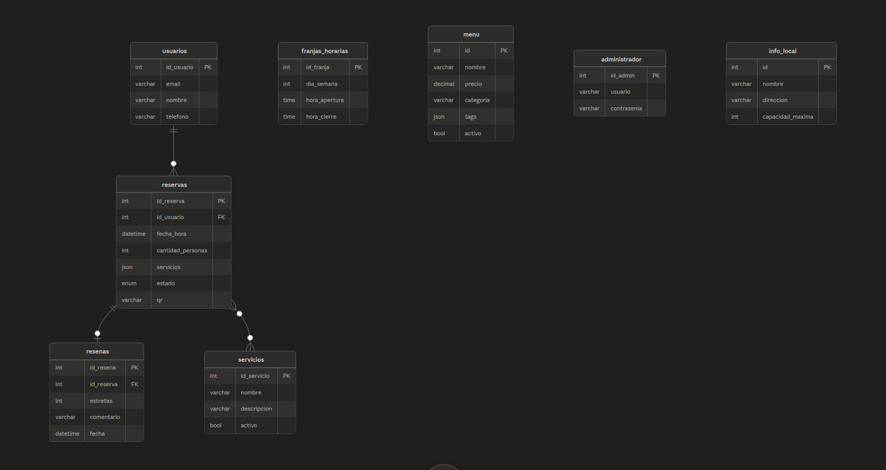

# Informe de Proyecto: Sistema de Reservas para Cafetería
Objetivo
El proyecto consiste en una aplicación web para la gestión de reservas de una cafetería. Permite a los clientes hacer reservas online y a los administradores del local gestionar el flujo completo del negocio desde un panel de control.
La aplicación está dividida en dos partes que se comunican mediante una API RESTful: un backend desarrollado en Flask que expone los endpoints, y un frontend también en Flask que consume esa API y renderiza las vistas con Jinja2.

**Integrantes:**
- Pablo Valentin Fraga, 115934
- Marco Pascual Grizzo Martinez, 114241
- Sofía Toledo, 114940
- Nadia Alejandra Romero Arvire, 115495

## Funciones principales

- Registro de usuarios a partir de la creación de reservas con selección de servicios adicionales
- Generación y envío de código QR por email para el check-in en el local
- Panel de administración para visualizar, confirmar, cancelar y actualizar reservas
- Gestión del menú (crear, editar, activar/desactivar platos)
- Gestión de servicios adicionales ofrecidos por el local
- Configuración de franjas horarias por día de la semana
- Sistema de reseñas post-visita enviado por email luego del check-in
- Estadísticas básicas en el dashboard (total de reservas, reservas del día, cancelaciones, reseñas)

## Tecnologías utilizadas

- Flask – framework principal tanto para el backend (API RESTful) como para el frontend (rutas y renderizado de templates)
- MySQL – base de datos relacional gestionada con mysql-connector-python
- Jinja2 – motor de templates para el renderizado HTML en el frontend
- Flask-Mail – envío de emails con templates HTML (confirmación de reserva, post check-in)
- qrcode + Pillow – generación de códigos QR adjuntos en los emails
- PyJWT + bcrypt – autenticación del administrador con tokens JWT y contraseñas hasheadas
- python-dotenv – gestión de variables de entorno

## Base de datos
La base de datos se llama *cafeteria* y contiene las siguientes tablas:
|  **Tabla**       |    **Descripción**                                                       |
|------------------|--------------------------------------------------------------------------|
| usuarios         | Datos de los clientes que realizan reservas (nombre, email, teléfono)|
| reservas         | Reservas registradas, con estado, cantidad de personas, servicios elegidos y código QR único|
| franjas_horarias | Horarios de apertura y cierre configurables por día de la semana|
| servicios        | Servicios adicionales ofrecidos por el local (pueden activarse o desactivarse)|
| menu             | Platos del menú con nombre, descripción, precio, categoría, tags e imagen|
| resenas          | Reseñas vinculadas a una reserva completada, con puntaje y comentario|
| administrador    | Credenciales del administrador del sistema|
| info_local       | Datos generales del local (nombre, dirección, capacidad máxima, contacto)|

**Endpoints desarrollados**: declarados en el archivo *swagger.yaml*

## Dificultades presentadas:
Las principales dificultades fueron:
- La configuración inicial de la base de datos y la conexión entre el backend y el frontend en puertos distintos.
- La implementación de la autenticación con JWT y su validación en cada request.
- El manejo de la paginación y los filtros en el dashboard sin afectar el rendimiento.
- La generación y envío de códigos QR por email.
- La coordinación entre los integrantes del equipo y la integración de las diferentes partes del proyecto.

## Aprendizajes:
A lo largo del desarrollo aprendimos:
- A diseñar una API RESTful con Flask, separando correctamente las capas de rutas, servicios y repositorios.
- A manejar autenticación con JWT y hashear contraseñas con bcrypt.
- A generar códigos QR y enviar emails automáticos con Flask-Mail.
- A trabajar con paginación y filtros en el backend para optimizar la carga de datos.
- A organizar un proyecto en equipo usando Git y GitHub.

## Mejoras:
Para futuras versiones del proyecto, se podría mejorar:
- El dashboard, agregando gráficos visuales de reservas por día, semana o mes.
- El sistema de reseñas, permitiendo que los usuarios puedan adjuntar fotos a sus reseñas.
- El despliegue de la aplicación con Docker para facilitar la instalación en cualquier entorno.
- La implementación de pruebas unitarias para verificar el correcto funcionamiento de los endpoints.

## Conclusion:
El proyecto logró implementar un sistema funcional de gestión de reservas para una cafetería, cubriendo los requisitos principales: reservas con QR, panel de administración, gestión de menú y servicios, y sistema de reseñas.
La separación entre frontend y backend mediante una API RESTful permitió un desarrollo modular, y el uso de autenticación por JWT asegura el control de acceso al panel administrativo.
El código está estructurado en capas (rutas, servicios, repositorios) siguiendo buenas prácticas, y se utilizó Git para el control de versiones durante el desarrollo.
El sistema es funcional y puede ser utilizado en un entorno real, aunque existen aspectos que podrían optimizarse.
